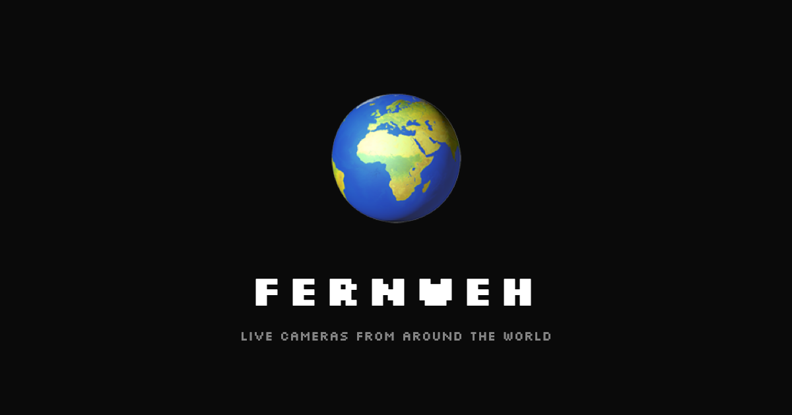

# Fernweh

<p align="center">
  
</p>

> **Fernweh** /ˈfɛʁnˌveː/ — German, *noun*
>
> From *fern* ("far, distant") + *Weh* ("pain, ache"). Literally "far-sickness" — an ache for distant places, a longing for somewhere you have never been. The opposite of homesickness.
>
> The term was coined by Prince Hermann von Pückler-Muskau in his 1835 book *The Penultimate Course of the World of Semilasso: Dream and Waking*, during the Romantic period when artists and writers were deeply drawn to exploring the boundaries of human emotion.
>
> While *Wanderlust* describes a joyful desire to travel, *Fernweh* conveys something deeper — a pain, a pull toward the unknown. It is the feeling of being homesick for a place you have never visited.
>
> — [BBC: The travel 'ache' you can’t translate](https://www.bbc.com/travel/article/20200323-the-travel-ache-you-cant-translate)

---

**🌍️🌍️🌍️Live Demo:** https://ubiquitous-o.github.io/Fernweh/ 🌍️🌍️🌍️

A fullscreen web app that automatically cycles through YouTube live cameras at the top of every hour. Hosted on **GitHub Pages** with video data refreshed by **GitHub Actions**.

## Features

- TV static noise transition between live streams (WebGL shader)
- Interactive 3D globe showing camera location ([COBE](https://github.com/shuding/cobe))
- Location detection from video title/channel/description ([Gemini API](https://ai.google.dev/) batch extraction + dictionary-first matching + fallback) with [Nominatim](https://nominatim.openstreetmap.org/) geocoding
- Dictionary-first optimization: skips Gemini API for known locations, saving RPD quota
- Auto-learning from geocache: previously resolved locations are merged into the dictionary at startup, reducing Gemini calls over time
- Full video description fetching via YouTube videos.list API for improved location accuracy
- Clock and 7-day weather forecast overlay (via [Open-Meteo](https://open-meteo.com/))
- Geolocation-based weather (browser Geolocation API → IP fallback → Tokyo fallback)
- Randomized search queries for maximum discovery
- Clickable video title — links to original YouTube video, resumes on browser back
- "City, Country" location labels on globe (auto line-break at comma)
  - **Note:** Globe labels are best-effort — location detection relies on video titles, channel names, and AI extraction, so labels may be inaccurate or missing for some streams
- Client-side video pool refresh every 2 hours (follows server-side updates)
- Auto-switch at the top of each hour with progress bar
- Auto-retry on playback failures
- Kiosk-friendly — Silkscreen bitmap font, cursor auto-hides, burn-in prevention

## Architecture

```
[GitHub Actions cron (every 2 hours)]
  → YouTube Data API v3 search (4 queries/run)
  → public/videos.json → git push

[GitHub Pages (static hosting)]
  → public/index.html + public/videos.json

[Browser]
  → Loads video candidates from videos.json
  → YouTube IFrame Player API for playback
  → COBE globe with pin-tracking label
  → WebGL shader TV noise during loading
  → Geolocation API / IP API → Open-Meteo for weather

[Location Detection (build-time)]
  → Load geocache.json → merge into dictionary (auto-learning)
  → Dictionary match first (hardcoded + learned locations)
  → Fetch full descriptions via YouTube videos.list API
  → Unmatched items → Gemini API batch (gemini-2.5-flash-lite, 20/batch)
  → Gemini result → dictionary coords or Nominatim geocoding
  → Fallback → dictionary match on title/channel
  → Nominatim cache → scripts/geocache.json (feeds next run's dictionary)

[Location Detection (runtime fallback)]
  → Title/channel → KNOWN_LOCATIONS dictionary match
```

## Setup

### 1. Get a YouTube Data API v3 Key

1. Go to [Google Cloud Console](https://console.cloud.google.com/)
2. Create a project
3. Enable **YouTube Data API v3** under APIs & Services > Library
4. Create an API key under APIs & Services > Credentials

### 2. Get a Gemini API Key (Free)

1. Go to [Google AI Studio](https://aistudio.google.com/apikey)
2. Create an API key (no credit card required)

### 3. Configure GitHub

1. Go to your repo's **Settings > Secrets and variables > Actions**
2. Add secrets:
   - `YOUTUBE_API_KEY` = your YouTube API key
   - `GEMINI_API_KEY` = your Gemini API key (optional — falls back to dictionary-only matching)
3. Go to **Settings > Pages** and set source to the `main` branch, `/public` folder (or `/ (root)`)
4. Go to **Actions** and manually trigger "Fetch Live Videos" to seed initial data

### 4. Done

The site will be live at `https://<username>.github.io/<repo>/`.
Videos are refreshed every 2 hours automatically.

## Local Development

```bash
# Fetch videos locally
YOUTUBE_API_KEY=your_key node scripts/fetch-videos.js

# Serve the static site
npx serve public
```

## Local Server Mode (Optional)

For dedicated hardware (N100 kiosk, Raspberry Pi, etc.), the Express server is still available:

```bash
cp config.example.json config.json
# Edit config.json with your API key
npm install express
npm run start:local
```

## Controls

| Key | Action |
|-----|--------|
| `Space` / `→` / `N` | Skip to next camera |
| `F` / `F11` | Toggle fullscreen |
| Mouse move | Show control buttons |

## API Quotas

**YouTube Data API v3**
- 4 searches/cron × 100 quota = 400 quota/run
- 1 videos.list/cron × 1 quota/video ≈ 50–100 quota/run
- Every 2 hours × 12 runs/day ≈ **6,000 quota/day** (60% of free 10,000)

**Gemini API (gemini-2.5-flash-lite)**
- 0–1 batch request/run (skipped when all items are dictionary-matched)
- Max 12 runs/day = **≤12 requests/day** (free tier: 20 RPD)

## Project Structure

```
fernweh/
├── public/
│   ├── index.html        # Frontend (single-page, inline CSS/JS)
│   └── videos.json       # Video candidates (generated by Actions)
├── scripts/
│   ├── fetch-videos.js   # YouTube API search + Gemini location extraction
│   └── geocache.json     # Nominatim geocoding cache
├── .github/workflows/
│   ├── fetch-videos.yml  # Cron workflow (every 2 hours)
│   └── deploy-pages.yml  # GitHub Pages deployment
├── server.js             # Express server (local/kiosk mode)
├── config.example.json   # Config template (local mode)
├── package.json
└── README.md
```
